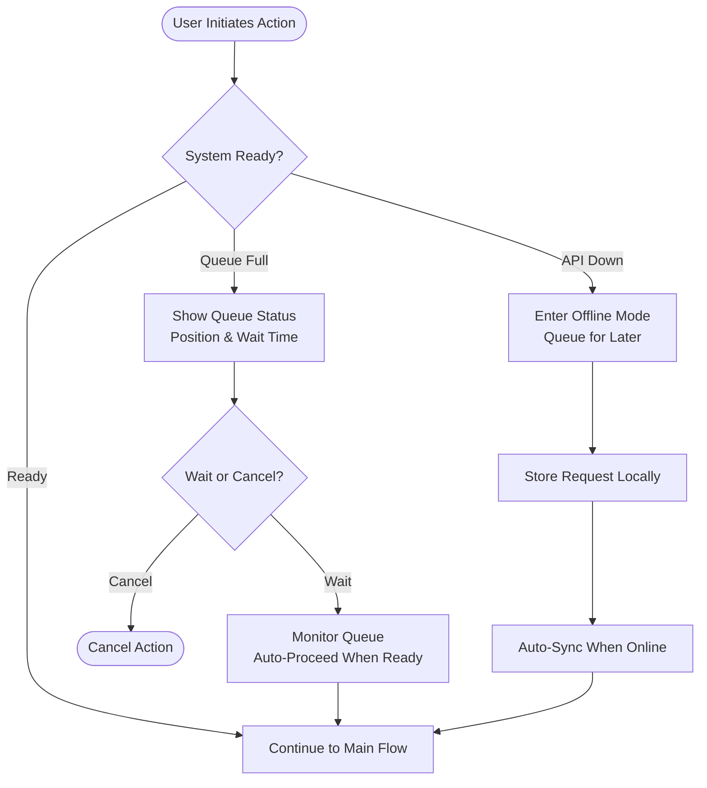
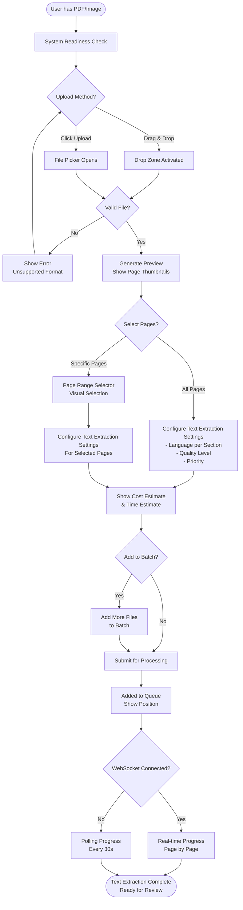

```mermaid
graph TD
    Start([Extracted Text Ready]) --> Context[Analyze Document Context<br/>- Domain Detection<br/>- Language Pairs]

    Context --> GlossarySelect{Select Glossary}
    GlossarySelect -->|Auto| AutoSelect[Load Best Match<br/>Based on Context]
    GlossarySelect -->|Manual| ManualSelect[Choose from List<br/>or Create New]

    AutoSelect --> Version[Load Glossary<br/>Version Control]
    ManualSelect --> Version

    Version --> Detect[Pre-scan for<br/>Glossary Terms]

    Detect --> Highlight[Highlight & Lock<br/>Glossary Terms]

    Highlight --> Configure[Translation Settings<br/>- Target Language<br/>- AI Provider<br/>- Formality Level<br/>- Context Window Size]

    Configure --> Process[Begin Translation<br/>Preserve Locked Terms]

    Process --> NewTerms{New Terms<br/>Detected?}

    NewTerms -->|Yes| Suggest[AI Suggests<br/>Glossary Additions]
    NewTerms -->|No| Apply[Apply Existing<br/>Glossary]

    Suggest --> UserReview{User Reviews<br/>Suggestions}
    UserReview -->|Accept| UpdateGlossary[Update Glossary<br/>For Next Docs]
    UserReview -->|Modify| EditTerms[Edit Suggestions]
    UserReview -->|Reject| Apply

    EditTerms --> UpdateGlossary
    UpdateGlossary --> Apply

    Apply --> QualityCheck{Quality Score}

    QualityCheck -->|>90%| AutoApprove[Mark as 'Touched'<br/>Flag High Quality]
    QualityCheck -->|<90%| ManualReview[Open Side-by-Side<br/>Editor]

    AutoApprove --> Save[Save Translation<br/>Version Control]

    ManualReview --> Verify[User Verifies/<br/>Edits Translation]

    Verify --> Learn{Learn from Edits?}
    Learn -->|Yes| UpdatePatterns[Update Translation<br/>Patterns]
    Learn -->|No| Save2[Save Translation<br/>Mark as 'Verified']

    UpdatePatterns --> Save2

    Save --> Complete([Translation Complete])
    Save2 --> Complete
```

```mermaid
graph TD
    Start([Multiple Documents<br/>Selected]) --> Template{Use Template?}

    Template -->|Yes| LoadTemplate[Load Processing<br/>Template]
    Template -->|No| ConfigType{Config Type?}

    LoadTemplate --> ValidateTemplate{Template Valid<br/>For All Docs?}
    ValidateTemplate -->|Yes| ApplyTemplate[Apply Settings<br/>To All]
    ValidateTemplate -->|No| ShowConflicts[Show Conflicts<br/>Per Document]

    ShowConflicts --> ResolveConflicts[Resolve Each<br/>Conflict]
    ResolveConflicts --> ApplyTemplate

    ConfigType -->|Uniform| UniformSettings[Configure Once<br/>Apply to All]
    ConfigType -->|Individual| IndividualSettings[Configure Each<br/>Save as Template?]

    IndividualSettings --> SaveTemplate{Save Config<br/>as Template?}
    SaveTemplate -->|Yes| CreateTemplate[Create New Template<br/>Name & Share Settings]
    SaveTemplate -->|No| ApplyIndividual[Apply Individual<br/>Settings]

    CreateTemplate --> ApplyIndividual
    UniformSettings --> ApplyTemplate

    ApplyTemplate --> Priority[Set Batch Priority<br/>& Resource Allocation]
    ApplyIndividual --> Priority

    Priority --> ResourceCheck{Resources<br/>Available?}

    ResourceCheck -->|Limited| Optimize[Optimize Schedule<br/>- Off-peak Processing<br/>- Staggered Start]
    ResourceCheck -->|Available| Queue[Add to Processing<br/>Queue]

    Optimize --> Queue

    Queue --> Ownership[Assign Ownership<br/>& Permissions]

    Ownership --> View[Queue Dashboard<br/>- Position<br/>- Progress<br/>- Resource Usage]

    View --> Monitor{Monitor Type?}

    Monitor -->|Active| Live[Live Progress View<br/>WebSocket Updates]
    Monitor -->|Passive| Notify[Background Processing<br/>Configurable Notifications]

    Live --> Action{User Action?}

    Action -->|Pause| PauseFlow[Pause with State<br/>Save to Database]
    Action -->|Reorder| CheckPerm{Has Permission?}
    Action -->|Cancel| CancelFlow[Cancel & Save<br/>Partial Results]
    Action -->|Edit| EditQueue[Edit Settings<br/>For Queued Items]
    Action -->|Continue| Process[Continue Processing]

    CheckPerm -->|Yes| Reorder[Drag to Reorder<br/>Update Priority]
    CheckPerm -->|No| DenyReorder[Show Permission<br/>Error]

    Reorder --> Process
    DenyReorder --> Process
    EditQueue --> Process

    PauseFlow --> StateStore[(Store State<br/>in Database)]
    StateStore --> Resume[Resume Button<br/>Appears]
    Resume --> RestoreState[Restore from<br/>Database]
    RestoreState --> Process

    Process --> ItemComplete{Doc Complete?}

    ItemComplete -->|No| NextPage[Process Next Page<br/>Update Progress]
    ItemComplete -->|Yes| LearnFromDoc[Extract Patterns<br/>Update Template]

    NextPage --> ItemComplete
    LearnFromDoc --> NextDoc{More Docs?}

    NextDoc -->|Yes| AdaptiveLoad[Adaptive Resource<br/>Allocation]
    NextDoc -->|No| GenerateReport[Generate Batch<br/>Report]

    AdaptiveLoad --> Process

    GenerateReport --> SaveReport[Save Report<br/>Email Summary]
    SaveReport --> BatchComplete([Batch Complete])

    Notify --> BatchComplete
    CancelFlow --> PartialResults([Partial Results<br/>Available])
```

# Enterprise Translation, Transcription & Document Processing Platform UI/UX Specification

## Introduction

This document defines the user experience goals, information architecture, user flows, and visual design specifications for Enterprise Translation, Transcription & Document Processing Platform's user interface. It serves as the foundation for visual design and frontend development, ensuring a cohesive and user-centered experience.

### Overall UX Goals & Principles

#### Target User Personas

**1. Content Processor (Primary User):** Religious scholars and document specialists at organizations like Hare Krishna Mandir who need to digitize and translate large archives of sacred texts. They prioritize accuracy over speed and need clear visibility into processing status.

**2. Organization Administrator:** IT managers who configure the platform for their organization, manage users, set up glossaries, and monitor usage. They need comprehensive control panels and clear cost visibility.

**3. Reviewer/Verifier:** Quality assurance specialists who verify text extraction and translation accuracy. They need efficient comparison tools and the ability to quickly correct errors.

*Note: Gap identified - "Content Consumer" persona (end readers of translated content) to be added in PRD update*

#### Usability Goals

- **Confidence in Quality:** Users can trust the platform to maintain 95%+ accuracy for religious and cultural terminology
- **Process Transparency:** Users always know what's happening with their documents through clear progress indicators
- **Efficient Batch Processing:** Power users can process hundreds of documents with minimal manual intervention
- **Error Recovery:** Users can easily identify and correct text extraction/translation errors without losing work
- **Accessibility First:** Platform is fully accessible to users with disabilities (WCAG AA compliance)

#### Design Principles

1. **Quality Over Speed** - Interface clearly communicates that processing takes time to ensure accuracy
2. **Progressive Complexity** - Start with simple drag-and-drop, reveal advanced features as needed
3. **Visual Processing States** - Every stage of text extraction/translation has distinct visual representation
4. **Context Preservation** - Design maintains cultural sensitivity and respect for religious content
5. **White-Label Ready** - Component architecture supports complete visual customization

### Change Log

| Date | Version | Description | Author |
|------|---------|-------------|--------|
| 2025-01-24 | 1.0 | Initial UI/UX specification creation | Sally (UX Expert) |

## Information Architecture (IA)

### Site Map / Screen Inventory

```mermaid
graph TD
    A[Landing/Login] --> B[Dashboard]
    A --> Y[Public Viewer - TBD]

    B --> C[Documents]
    B --> D[Processing]
    B --> E[Review]
    B --> F[Analytics]
    B --> G[Settings]

    C --> C1[Upload Center]
    C --> C2[Document Library]
    C --> C3[Collections/Projects - TBD]
    C --> C4[Trash/Archive]

    D --> D1[Processing Queue]
    D --> D2[Text Extraction Pipeline]
    D --> D3[Translation Pipeline]
    D --> D4[Batch Manager]

    E --> E1[Verification Queue]
    E --> E2[Source Text/Translation Editor]
    E --> E3[Glossary Manager]
    E --> E4[Quality Reports]

    F --> F1[Usage Dashboard]
    F --> F2[Quality Metrics]
    F --> F3[Cost Analysis]
    F --> F4[User Activity]

    G --> G1[Organization]
    G --> G2[Users & Roles]
    G --> G3[AI Providers]
    G --> G4[White Label]
    G --> G5[Integrations]
    G --> G6[Billing]

    Y --> Y1[Public Documents]
    Y --> Y2[Shared Collections]
```



### Navigation Structure

**Primary Navigation:**
- Horizontal top bar with 6 main sections (Dashboard, Documents, Processing, Review, Analytics, Settings)
- Role-based visibility: Content Processors see Documents/Processing/Review; Administrators see all sections
- Active section highlighted with brand color and subtle animation

**Secondary Navigation:**
- Left sidebar (240px collapsed to 60px) within each main section
- Shows 4-6 subsections with icons and labels
- Collapsible to maximize screen space for document editing
- Remembers user's collapse preference per session

**Breadcrumb Strategy:**
- Full hierarchical path: Dashboard → Section → Subsection → Item → Action
- Example: `Dashboard > Documents > Upload Center > Batch-2025-01-24 > Processing`
- Clickable at each level for quick navigation backwards
- Mobile: Shortened to show only parent and current level

### IA Design Rationale

**Document Lifecycle Alignment:**
The architecture follows the natural document processing flow:
1. **Input** (Documents section) - Where content enters the system
2. **Process** (Processing section) - Where text extraction and translation happen
3. **Verify** (Review section) - Where quality is ensured
4. **Analyze** (Analytics section) - Where results are measured

**Separation of Concerns:**
- **Processing vs Review:** Deliberately separated to match FR5's two-stage pipeline ("touched" → "verified")
- **Glossary Placement:** Located under Review where it's actively used during verification, not under Documents
- **Batch Manager:** Placed under Processing where batch operations are monitored, not initiated

**Role-Based Structure:**
- Content Processors: Primary workflow through Documents → Processing → Review
- Administrators: Focus on Analytics and Settings
- Reviewers: Concentrated tools in Review section
- Public Consumers: Separate Y-branch pathway (pending PRD definition)

## User Flows

### Pre-Flow: System Readiness Check

**User Goal:** Ensure system is ready before initiating any processing

**Entry Points:** Any action that requires processing resources

**Success Criteria:** User proceeds only when system can handle their request

**Flow Diagram:**


### Flow 1: Document Upload & Text Processing (Enhanced)

**User Goal:** Upload a scanned religious manuscript and extract text with page-level control

**Entry Points:** Dashboard quick action, Documents > Upload Center, drag-drop from anywhere

**Success Criteria:** Document successfully processed with desired pages extracted accurately

**Flow Diagram:**


**Edge Cases & Error Handling:**
- File >100MB: Offer page range selection to reduce size
- Multi-script detection: Apply different language models per section
- Network interruption: Auto-resume with WebSocket reconnection
- Duplicate file: Show diff comparison with existing version
- Text extraction confidence low: Flag specific pages for manual review
- Mixed content PDF: Process digital and scanned pages separately

### Flow 2: Translation with Glossary Management (Enhanced with Learning Loop)

**User Goal:** Translate extracted text while maintaining terminology consistency and improving glossary

**Entry Points:** From text extraction completion, Review > Verification Queue, Document Library action

**Success Criteria:** Translation preserves religious terminology with glossary learning

**Flow Diagram:**


**Edge Cases & Error Handling:**
- Glossary conflicts: Show term genealogy and usage stats
- Glossary versions: Allow rollback to previous versions
- API provider switch mid-flow: Maintain consistency
- Context overflow: Smart chunking with overlap
- Terminology drift: Alert when terms usage changes over time

### Flow 3: Batch Processing & Queue Management (Enhanced with Templates)

**User Goal:** Process multiple documents efficiently with templates and intelligent queue management

**Entry Points:** Documents > Upload Center, Processing > Batch Manager, Template Library

**Success Criteria:** All documents processed according to template with optimal resource usage

**Flow Diagram:**


**Edge Cases & Error Handling:**
- Template version mismatch: Offer migration or use latest
- Queue ownership transfer: Admin can reassign orphaned jobs
- Resource spike: Automatic throttling with user notification
- Partial failure: Intelligent retry with different settings
- Priority deadlock: Admin resolution interface
- Template permissions: Private, team, or organization-wide sharing

## AI UI Generation Prompts (Lovable/Bolt)

*Note: These prompts are designed for Lovable.dev or Bolt.new to generate complete React + Tailwind + shadcn/ui interfaces. Each prompt includes all specifications, interactions, and state management requirements.*

### Prompt 1: Dashboard Home Screen

```
Create a modern dashboard for an enterprise translation and document processing platform with the following specifications:

LAYOUT:
- Full-screen responsive dashboard with a clean, professional design
- Use a 12-column grid system with 24px gutters
- Background: subtle gray (#F9FAFB) with white cards
- Header: Fixed top navigation bar (64px height) with logo, main nav items (Dashboard, Documents, Processing, Review, Analytics, Settings), and user profile dropdown

MAIN DASHBOARD COMPONENTS (arrange in priority order):

1. Active Processing Widget (top-left, spans 8 columns):
   - Card with title "Active Processing"
   - Real-time progress bars for current text extraction and translation jobs
   - Each progress bar shows: document name, progress percentage, time remaining, pause/cancel buttons
   - Use animated gradient progress bars (blue to green as they complete)
   - Maximum 5 items shown, with "View All" link to queue

2. Quick Upload Zone (top-right, spans 4 columns):
   - Dashed border (#D1D5DB) that turns solid blue on hover
   - Large upload icon in center
   - Text: "Drag files here or click to upload"
   - Accepts: PDF, JPG, PNG, DOCX
   - On file drop: show immediate preview and processing options

3. Queue Status Cards (second row, 3 cards, 4 columns each):
   - Card 1: "Pending" - number with orange badge
   - Card 2: "Processing" - number with animated blue pulse
   - Card 3: "Completed Today" - number with green check
   - Each card is clickable to filter the queue view

4. Recent Documents Grid (third row, spans 12 columns):
   - Title: "Recent Documents" with "View All" link
   - Grid of 6-8 document cards (responsive: 4 on desktop, 2 on tablet, 1 on mobile)
   - Each card: thumbnail preview, document title, status badge (Processing/Ready/Verified), last modified time
   - Hover effect: slight elevation and show quick actions (Download, Reprocess, Delete)

5. Quality Metrics Summary (bottom-left, spans 6 columns):
   - Title: "Quality Metrics - Last 7 Days"
   - Circular progress chart showing average accuracy (target: 95%)
   - Below: three metrics in row: Text Extraction Quality, Translation Quality, Documents Verified
   - Use color coding: green (>90%), yellow (70-90%), red (<70%)

6. System Health Panel (bottom-right, spans 6 columns):
   - API Status indicators: Gemini (green/red dot), OpenAI (green/red dot), Supabase (green/red dot)
   - Current quota usage: progress bar showing percentage used
   - Active users online: number with user icon
   - Last sync time with relative timestamp

INTERACTIONS:
- All cards have subtle shadow on hover (shadow-md)
- Smooth transitions (transition-all duration-200)
- Loading states: use skeleton screens with shimmer effect
- Empty states: friendly illustrations with action prompts
- Pull-to-refresh on mobile
- Real-time updates via WebSocket (show connection status in header)

RESPONSIVE BEHAVIOR:
- Desktop (>1280px): Full layout as described
- Tablet (768-1280px): Stack to 2 columns, hide some metrics
- Mobile (<768px): Single column, collapsible sections, bottom navigation

COLOR SCHEME:
- Primary: Blue (#3B82F6)
- Success: Green (#10B981)
- Warning: Orange (#F59E0B)
- Error: Red (#EF4444)
- Text: Gray-900 (#111827)
- Borders: Gray-200 (#E5E7EB)

Use React with TypeScript, Tailwind CSS, and shadcn/ui components. Include Framer Motion for smooth animations. Setup React Query for data fetching and Zustand for state management.
```

### Prompt 2: Upload Center with Content Preparation

```
Create an advanced upload center for document processing with content preparation settings:

LAYOUT:
- Two-panel layout with 60/40 split (upload area / configuration panel)
- Collapsible right panel on mobile
- Sticky configuration panel that scrolls independently

LEFT PANEL - UPLOAD AREA:

1. Drop Zone (takes 70% of panel height):
   - Large dashed border (3px, #9CA3AF) with rounded corners (8px)
   - Animated dashed border on hover (use CSS animation)
   - Center content: Upload cloud icon (64px), "Drop your files here", "Support for PDF, JPG, PNG, DOCX (max 100MB)"
   - On drag over: blue overlay with "Release to upload" text
   - Show file type validation in real-time (green checkmark or red X)

2. File Preview Section (remaining 30%):
   - Horizontal scrolling list of uploaded files
   - Each file card (160px x 200px): thumbnail, filename (truncated), file size, remove button (X)
   - For PDFs: show page count badge
   - Show upload progress bar during upload
   - Error state: red border with error message tooltip

RIGHT PANEL - CONFIGURATION:

1. Language Detection Section:
   - Toggle: "Auto-detect language" (default on)
   - When off: Multi-select dropdown for languages (English, Hindi, Marathi, Bengali, Gujarati, German)
   - Per-page language override option (shows page thumbnails with language selector)

2. Text Extraction Quality Settings:
   - Radio buttons: "Fast" (draft), "Balanced" (default), "Maximum" (highest accuracy)
   - Show time/cost implications for each option
   - Advanced settings (collapsible):
     - Confidence threshold slider (0-100%)
     - Image preprocessing toggles (deskew, denoise, contrast enhancement)
     - Page orientation: Auto/Portrait/Landscape

3. Page Selection (appears after file upload):
   - Thumbnail grid of all pages (4 columns)
   - Checkbox on each thumbnail for selection
   - Quick actions: "Select All", "Select Odd", "Select Even", "Select Range"
   - Page range input: "1-5, 8, 10-15"

4. Batch Configuration:
   - Toggle: "Add to batch"
   - Batch name input field
   - Priority selector: Low/Normal/High/Urgent
   - Schedule option: "Process immediately" or datetime picker

5. Template Section:
   - Dropdown: "Select saved template" or "Save current as template"
   - Template includes all settings above
   - Quick templates: "Sanskrit Manuscripts", "Modern Documents", "Mixed Content"

6. Cost & Time Estimator (sticky bottom):
   - Live calculation based on pages and settings
   - Shows: Estimated cost ($X.XX), Processing time (X minutes), Queue position
   - "Process Now" button (primary, full width)
   - "Add to Queue" button (secondary)

INTERACTIONS:
- Settings auto-save to localStorage
- Tooltips on hover for all settings explaining impact
- Keyboard shortcuts: Ctrl+V to paste, Delete to remove selected
- Drag to reorder files in preview
- Show processing estimation update in real-time as settings change

STATES:
- Empty: Prominent drop zone with helper text
- Uploading: Progress bars with cancel option
- Processing: Lock configuration, show queue position
- Error: Clear error messages with retry options
- Success: Green checkmark with "View Results" button

Use React, TypeScript, Tailwind CSS, shadcn/ui, react-dropzone for file handling, and react-window for virtualized page grid.
```

### Prompt 3: Two-Panel Progressive Editor (Source Text → Translation)

```
Create a sophisticated two-panel progressive editor with staged workflow for source text editing then translation:

LAYOUT:
- Two equal panels with resizable divider (using react-resizable-panels)
- Stage 1: Source Document | Source Text Editor
- Stage 2: Source Document | Translation Editor (after text approval)
- Toolbar at top (56px height) with stage indicator and actions
- Status bar at bottom (32px) with quality scores and save status

WORKFLOW STAGES:

Stage Indicator (in toolbar):
- Visual pipeline: [1. Source Text Editor] → [2. Translation Editor] → [3. Complete]
- Current stage highlighted with primary color
- Completed stages show green checkmark
- Click to navigate between completed stages

TOOLBAR:
- Left section: Document name, page indicator (Page X of Y)
- Center section: Stage progress indicator with current stage highlighted
- Right section: Stage action button ("Approve Text & Proceed" or "Approve Translation & Complete")

STAGE 1 - SOURCE TEXT EDITING MODE:

Left Panel - SOURCE DOCUMENT:
- PDF.js viewer for PDFs, image viewer for images
- Zoom controls (25%-400%) with smooth zoom
- Pan tool for navigation
- Highlight tool to mark problem areas
- Page thumbnails sidebar (collapsible)

Right Panel - SOURCE TEXT EDITOR:
- Monaco Editor or CodeMirror with custom theme
- Line numbers on left
- Confidence highlighting:
  - High confidence (>95%): no highlight
  - Medium (80-95%): yellow background (#FEF3C7)
  - Low (<80%): red background (#FEE2E2)
- Right-click context menu:
  - "Add to glossary"
  - "Mark as verified"
  - "Report issue"
  - "Show alternatives" (shows other text recognition possibilities)
- Inline buttons on hover:
  - Merge with previous line
  - Split into two lines
  - Delete line
  - Insert line above/below
- Real-time spell check with red underlines
- Find & Replace with regex support (Ctrl+F)

Action Button (Stage 1):
- Primary button: "Approve Text & Proceed to Translation"
- Secondary: "Save Draft"
- Warning if low confidence areas not reviewed

STAGE 2 - TRANSLATION REVIEW MODE:

Left Panel - SOURCE DOCUMENT (Same as Stage 1)
- Original document remains visible
- Optional: Toggle to show source text instead
- Quick reference panel showing approved source text

Right Panel - TRANSLATION EDITOR:
- Similar editor setup as Panel 2
- Glossary terms highlighted in purple (#8B5CF6)
- Hover on glossary term: show tooltip with source term and definition
- Side panel (collapsible) with:
  - Active glossary info
  - Translation memory matches
  - AI confidence scores
  - Alternative translations
- Language selector for target language (if multiple)
- Translation confidence scores
- Alternative translation suggestions

Action Button (Stage 2):
- Primary: "Approve Translation & Mark Verified"
- Secondary: "Request Human Review"
- Option: "Back to Source Text" (if issues found)

STAGE NAVIGATION:
- Progress bar showing: Source Text Editor → Translation Editor → Complete
- Click on completed stages to navigate back
- Keyboard shortcuts: Alt+1 (Source Text), Alt+2 (Translation)
- Warning when leaving stage with unsaved changes

SYNCHRONIZATION FEATURES:
- Scroll sync between panels (toggleable)
- Line mapping for reference
- Split position remembered per user

BOTTOM STATUS BAR:
- Text Recognition Confidence: XX% (with breakdown link)
- Translation Quality: BLEU score
- Glossary matches: X terms
- Changes: X unsaved (auto-save in 30s)
- Character/word count
- Keyboard shortcuts helper (?)

FLOATING ACTION PANEL (bottom-right):
- Quick actions based on selection:
  - "Approve & Next" (marks verified, goes to next document)
  - "Flag for Review" (adds to review queue)
  - "Request Human Review"
  - "Regenerate Section" (re-process text/translation)

INTERACTIONS:
- Keyboard navigation: Tab between panels, arrows for navigation
- Shortcuts:
  - Ctrl+S: Manual save
  - Ctrl+Enter: Approve and next
  - Ctrl+/: Toggle glossary panel
  - Alt+1/2/3: Focus panel
- Diff mode: Show changes with green/red highlighting
- Version history: Slider to navigate through save points
- Comments: Add inline comments for reviewers

RESPONSIVE:
- Desktop: Two panels side-by-side (50/50 split)
- Tablet: Tabs for Source/Output with stage indicator
- Mobile: Stack vertically with sticky stage selector

BENEFITS OF TWO-PANEL PROGRESSIVE APPROACH:
- Clearer workflow with explicit approval gates
- More screen space for each document (50% vs 33%)
- Reduced cognitive load - focus on one task at a time
- Better tablet/mobile experience
- Aligns with two-stage pipeline from requirements

Use React, TypeScript, Tailwind CSS, shadcn/ui, @monaco-editor/react or @uiw/react-codemirror, react-pdf for PDF viewing, and Zustand for editor state management.
```

### Prompt 4: Processing Queue Management System

```
Create a dynamic processing queue with Kanban board and list view toggle:

HEADER BAR (sticky):
- Title: "Processing Queue" with live count badge
- View toggle: Kanban (default) | List view
- Filter chips: All, My Documents, Urgent, Failed (show counts)
- Search bar with filters (document name, status, date range)
- Bulk actions dropdown: Pause All, Resume All, Clear Completed
- Resource meter: Shows system capacity (e.g., "Using 7/10 workers")

KANBAN VIEW LAYOUT:

Columns (equal width, horizontal scroll if needed):
1. "Queued" - gray header (#6B7280)
2. "Text Processing" - blue header (#3B82F6) with animated pulse
3. "Translating" - purple header (#8B5CF6) with animated pulse
4. "In Review" - orange header (#F59E0B)
5. "Completed" - green header (#10B981)

Each column:
- Column header with count badge and info icon (tooltip shows average time in stage)
- Scrollable content area (max-height 70vh)
- Drop zone indicator when dragging

DOCUMENT CARDS (in each column):

Card structure (white background, 8px rounded, shadow-sm):
- Header: Document icon + truncated filename (max 30 chars)
- Thumbnail: 120px height image/PDF preview
- Progress section:
  - For processing: animated progress bar with percentage
  - For queued: position in queue (#3 of 12)
  - For completed: checkmark with completion time
- Metadata row: File size | Page count | Language
- Time info: Started/ETA/Completed (contextual)
- Owner avatar and name
- Priority badge (if high/urgent)
- Action buttons (on hover):
  - View details (eye icon)
  - Pause/Resume (play/pause icon)
  - Move to top (arrow up)
  - Cancel (X icon)

Drag and drop:
- Cards draggable between columns (with permission check)
- Visual feedback: card tilts slightly when grabbed
- Drop preview: ghost card shows where it will land
- Invalid drop: red border flash

LIST VIEW LAYOUT:

Table structure with sticky header:
- Columns: Status, Document, Progress, Owner, Priority, Started, ETA, Actions
- Row height: 56px for comfortable clicking
- Alternating row colors for readability
- Hover: highlight row with light blue (#EFF6FF)

List features:
- Sortable columns (click header to sort)
- Inline editing for priority
- Batch selection with checkboxes
- Expandable row for details (chevron icon)
- Status column uses same colors as Kanban headers

FLOATING BATCH PANEL (appears when items selected):
- Shows "X items selected"
- Actions: Change Priority, Reassign, Pause, Resume, Cancel
- Clear selection button

REAL-TIME UPDATES:
- WebSocket connection for live updates
- Progress bars animate smoothly
- New items slide in from top
- Completed items fade out after 5 seconds
- Connection status indicator (green dot when live)

EMPTY STATES:
- Queued: "No documents waiting. Drop files to get started!"
- Processing: "All clear! Workers are ready."
- Completed: "No recently completed documents."
- Include illustration and action button

FILTERS PANEL (collapsible sidebar):
- Date range picker
- Language multi-select
- File type checkboxes
- Owner/User selector
- Priority levels
- Processing status
- Save filter as preset

Use React, TypeScript, Tailwind CSS, react-beautiful-dnd for drag-drop, tanstack/react-table for list view, and Socket.io-client for real-time updates.
```

### Prompt 5: Glossary Manager Interface

```
Create a comprehensive glossary management system for translation consistency:

LAYOUT:
- Split view: 70% main content (glossary table), 30% detail panel
- Sticky header with title and actions
- Responsive: Stack panels on tablet/mobile

HEADER:
- Title: "Translation Glossary" with term count
- Domain selector: All, Religious, Technical, General (tabs)
- Search bar: "Search terms in any language..."
- Action buttons:
  - "Add Term" (primary button, opens modal)
  - "Import" (CSV, TMX, JSON upload)
  - "Export" (download current view)
  - "History" (version control)

MAIN TABLE:

Columns:
1. Source Term (sortable, searchable)
2. Target Translations (by language, expandable)
3. Domain/Category (badge style)
4. Usage Count (how many times applied)
5. Confidence Score (0-100% with color coding)
6. Last Modified (relative time)
7. Status (Active, Review, Deprecated)
8. Actions (Edit, Delete, History)

Row features:
- Expandable: Click to show usage examples from documents
- Inline editing: Double-click cells to edit
- Multi-select: Checkbox for batch operations
- Hover: Show full translations if truncated
- Context menu: Right-click for quick actions

DETAIL PANEL (when term selected):

Sections:
1. Term Information:
   - Source term with language
   - Phonetic/transliteration
   - Part of speech
   - Definition/notes field

2. Translations:
   - Tab for each target language
   - Multiple translation variants with priority
   - Context-specific translations
   - Usage guidelines

3. Usage Examples:
   - Live examples from processed documents
   - Before/after comparison
   - Link to source document

4. Metadata:
   - Created by/date
   - Modified history
   - Approval status
   - Tags

5. Related Terms:
   - Synonyms
   - Antonyms
   - See also references

ADD/EDIT TERM MODAL:

Fields:
- Source term (required)
- Source language (dropdown)
- Translations (dynamic add for each language)
- Domain (multi-select tags)
- Context notes (rich text editor)
- Example usage (optional)
- Priority level (for conflicts)

Validation:
- Check for duplicates
- Verify language compatibility
- Suggest similar existing terms

CONFLICT RESOLUTION UI:

When terms conflict:
- Show side-by-side comparison
- Usage statistics for each variant
- Context where each is used
- Resolution options:
  - Merge terms
  - Set priority order
  - Create context rule
  - Mark for review

VERSION HISTORY VIEW:

- Timeline of changes
- Diff view for modifications
- Restore previous version
- Change attribution
- Bulk revert option

IMPORT/EXPORT:

Import wizard:
- File format detection
- Column mapping interface
- Preview first 10 rows
- Conflict resolution options
- Progress bar for large files

Export options:
- Format: CSV, TMX, JSON, Excel
- Filters: Apply current filters
- Languages: Select which to include
- Include metadata checkbox

QUICK ACTIONS:

Floating action button (bottom-right):
- Quick add term
- Recent additions
- Pending reviews
- Import from clipboard

KEYBOARD SHORTCUTS:
- Ctrl+N: New term
- Ctrl+F: Focus search
- Ctrl+S: Save changes
- Delete: Remove selected
- Ctrl+Z: Undo last action

Use React, TypeScript, Tailwind CSS, tanstack/react-table for the data grid, lexical or draft-js for rich text editing, and react-hook-form for forms.
```

### Prompt Template for Additional Screens

```
For creating new screens, use this structure:

Create a [screen purpose] for [specific functionality]:

LAYOUT:
- [Overall layout structure]
- [Responsive behavior]
- [Key measurements]

[MAIN SECTIONS - repeat for each]:
- [Section name and purpose]
- [Visual hierarchy]
- [Interactive elements]
- [Data displayed]

INTERACTIONS:
- [User actions]
- [Feedback mechanisms]
- [Keyboard shortcuts]
- [Hover/focus states]

STATES:
- [Empty state]
- [Loading state]
- [Error state]
- [Success state]

REAL-TIME FEATURES:
- [Live updates]
- [WebSocket events]
- [Optimistic UI]

Use React, TypeScript, Tailwind CSS, shadcn/ui, and [specific libraries needed].
```

## Component Library / Design System

### Design System Approach

**Design System Approach:** AI-generated component library using shadcn/ui as the base, extended with custom components specific to text extraction/translation workflows. All components will be generated through Lovable with consistent design tokens.

### Core Components

#### 1. DocumentCard
**Purpose:** Display document information consistently across all views
**Variants:** Default (grid view), Compact (list view), Processing (with progress bar), Error (with retry action)
**States:** Idle, Hover, Selected, Processing, Complete, Error
**Usage Guidelines:** Use DocumentCard for any document representation. Always show thumbnail, title, and status. Include progress indicators for active processing.

#### 2. ProgressIndicator
**Purpose:** Show processing status for text extraction and translation operations
**Variants:** Linear (bar with percentage), Circular (for confined spaces), Stepped (for multi-stage processes), Pulse (for indeterminate progress)
**States:** Idle, Active, Paused, Complete, Error
**Usage Guidelines:** Always pair with time estimates when available. Use stepped variant for Text Extraction → Translation → Review pipeline. Animate smoothly to avoid jarring updates.

#### 3. GlossaryTerm
**Purpose:** Highlight and interact with glossary-managed terms
**Variants:** Inline (within text), Tooltip (hover display), Editable (in glossary manager), Conflict (multiple translations available)
**States:** Default, Hover, Active, Locked, Conflicted
**Usage Guidelines:** Purple highlight (#8B5CF6) for all glossary terms. Show definition on hover. Right-click to edit. Use lock icon for protected religious terms.

#### 4. SplitPanel
**Purpose:** Resizable panel layouts for document comparison
**Variants:** Two-panel (source/target), Three-panel (source/extracted text/translation), Tabbed (mobile view), Synchronized (scroll-locked)
**States:** Default, Resizing, Collapsed, Synced
**Usage Guidelines:** Minimum panel width 300px. Save user's preferred split ratio. Provide grab handles at least 8px wide for easy dragging.

#### 5. QueueItem
**Purpose:** Represent items in processing queue
**Variants:** Card (Kanban view), Row (list view), Minimal (sidebar widget), Detailed (expanded view)
**States:** Queued, Processing, Paused, Complete, Failed
**Usage Guidelines:** Always show position in queue, estimated time, and owner. Make draggable for reordering. Include quick actions on hover.

## Branding & Style Guide

### Visual Identity

**Brand Guidelines:** The platform should convey trustworthiness, spiritual respect, and technical sophistication. For HDA's implementation, incorporate subtle spiritual elements while maintaining professional enterprise software aesthetics.

### Color Palette

| Color Type | Hex Code | Usage |
|------------|----------|--------|
| Primary | #4F46E5 | Deep indigo - primary actions, headers, active states |
| Secondary | #7C3AED | Purple - secondary actions, highlights |
| Accent | #F59E0B | Saffron/orange - notifications, alerts, spiritual touch |
| Success | #10B981 | Green - completed, verified, positive states |
| Warning | #F59E0B | Orange - cautions, pending reviews |
| Error | #EF4444 | Red - errors, failures, critical alerts |
| Neutral | #1F2937, #6B7280, #E5E7EB | Text hierarchy, borders, backgrounds |

### Typography

#### Font Families
- **Primary:** Inter (clean, modern, excellent readability)
- **Secondary:** Noto Sans (supports all Indian languages)
- **Monospace:** JetBrains Mono (for code/text editing views)

#### Type Scale

| Element | Size | Weight | Line Height |
|---------|------|--------|-------------|
| H1 | 36px | 700 | 1.2 |
| H2 | 30px | 600 | 1.3 |
| H3 | 24px | 600 | 1.4 |
| Body | 16px | 400 | 1.6 |
| Small | 14px | 400 | 1.5 |

### Iconography

**Icon Library:** Lucide Icons (open-source, comprehensive, consistent style)

**Usage Guidelines:**
- Use outline style for navigation and actions
- Filled icons only for selected/active states
- Maintain 24px base size, scale proportionally
- Include tooltips for icon-only buttons
- Custom icons for text extraction, translation, and glossary features

### Spacing & Layout

**Grid System:** 12-column grid with 24px gutters on desktop, 16px on tablet, 12px on mobile

**Spacing Scale:**
- Base unit: 4px
- Scale: 4, 8, 12, 16, 24, 32, 48, 64, 96, 128
- Use consistently for padding, margins, gaps

### Shadcn/UI Integration

**Component Strategy:**
- Base components from shadcn/ui (accessible, customizable)
- Built on Radix UI primitives for accessibility
- Styled with Tailwind CSS for consistency
- Components copied directly into codebase for full control

**Theme Implementation with CSS Variables:**
```css
:root {
  --primary: 237 86% 64%;        /* Indigo */
  --primary-foreground: 0 0% 100%;
  --secondary: 270 66% 63%;      /* Purple */
  --secondary-foreground: 0 0% 100%;
  --accent: 38 92% 50%;          /* Saffron */
  --accent-foreground: 0 0% 0%;
  --destructive: 0 84% 60%;
  --muted: 210 40% 96%;
  --card: 0 0% 100%;
  --popover: 0 0% 100%;
  --border: 214 32% 91%;
  --input: 214 32% 91%;
  --ring: 237 86% 64%;
  --radius: 0.5rem;
}

.dark {
  --primary: 237 86% 70%;
  --background: 222 47% 11%;
  --foreground: 210 40% 98%;
  --muted: 217 33% 17%;
  --border: 217 33% 17%;
}
```

**White-Label Customization Points:**
- Primary/secondary colors via CSS variables
- Logo upload and placement
- Font family selection (from curated list)
- Accent color for brand personality
- Corner radius preference (via --radius variable)
- Light/dark mode themes

## Accessibility Requirements

### Compliance Target

**Standard:** WCAG 2.1 Level AA compliance as the baseline, with AAA for critical features

### Key Requirements

**Visual:**
- Color contrast ratios: Minimum 4.5:1 for normal text, 3:1 for large text (18pt+)
- Focus indicators: Visible outline (2px minimum) with 3:1 contrast ratio against background
- Text sizing: Base font 16px minimum, scalable to 200% without horizontal scrolling

**Interaction:**
- Keyboard navigation: All interactive elements accessible via keyboard with logical tab order
- Screen reader support: Proper ARIA labels, landmarks, and live regions for dynamic content
- Touch targets: Minimum 44x44px for mobile, 24x24px with adequate spacing on desktop

**Content:**
- Alternative text: Descriptive alt text for all images, especially document thumbnails
- Heading structure: Logical H1-H6 hierarchy, no skipped levels
- Form labels: All inputs have associated labels, required fields clearly marked

### Testing Strategy

Regular testing with:
- Screen readers (NVDA, JAWS, VoiceOver)
- Keyboard-only navigation
- Browser zoom at 200-400%
- Automated tools (axe DevTools, WAVE)
- User testing with people with disabilities

### Text Extraction/Translation-Specific Accessibility

**Two-Panel Progressive Workflow Accessibility:**
- Clear stage announcements for screen readers when moving between Source Text and Translation stages
- Keyboard shortcut (Alt+1/Alt+2) for stage navigation
- ARIA live regions for stage completion notifications
- Focus management when transitioning between stages

**Multi-Language Support:**
- Proper `lang` attributes for content sections
- RTL/LTR switching for mixed-direction text
- Screen reader pronunciation guides for Sanskrit terms

**Long Document Navigation:**
- Skip links to main content sections
- Table of contents with jump navigation
- Page-by-page keyboard shortcuts

**Progress Indicators:**
- ARIA live regions for status updates
- Audio cues for completion (optional)
- Alternative text descriptions of progress

**Error Handling:**
- Clear error messages near the input
- Multiple notification methods (visual + screen reader)
- Suggested corrections for common issues

### IMPORTANT UX IMPROVEMENT NOTE

**Two-Panel Progressive Editor Design Decision:**
Based on UX analysis, we've moved from a three-panel simultaneous view to a two-panel progressive workflow:
- Stage 1: Source Document | Source Text Editor
- Stage 2: Source Document | Translation

**Benefits:**
- Clearer workflow with approval gates between stages
- More screen space (50% per panel vs 33%)
- Reduced cognitive load
- Better accessibility with focused tasks
- Superior tablet/mobile experience

**Gap for PM/Architect:**
- Update PRD to reflect two-stage visual workflow
- Consider this pattern for FR5 (two-stage pipeline implementation)
- May affect API design for stage transitions

## Critical Updates from Recent Discussions

### 1. Vertex AI Gemini 2.5 Pro Specifications

**Model Details:**
- **Platform**: Google Cloud Vertex AI (NOT standard Gemini API)
- **Model**: Gemini 2.5 Pro
- **Input Token Limit**: 1,048,576 tokens (1 million)
- **Output Token Limit**: 65,536 tokens (65K)
- **Token Calculation**: 1 token ≈ 4 characters
- **Page Estimation**: 1 page ≈ 500 tokens

**Pricing (Vertex AI):**
- Input: $1.25 per million tokens (up to 200K)
- Input (long context): $2.50 per million tokens (over 200K)
- Output: $10 per million tokens

### 2. Structure Preservation Requirement

**Critical Discovery**: Translation must preserve document structure including:
- Line breaks and spacing
- Indentation levels
- Paragraph formatting
- Text alignment
- Visual hierarchy (as shown in Bengali→English example)

**Implementation Approach:**
```
Text Extraction with Layout → Structure Markers → Translation with Preservation → Formatted Output
```

### 3. Enhanced Translation Workflow

**Key Features Added:**
1. **Panel Swapping**: Left panel can toggle between Original PDF / Extracted Text / Split View
2. **Batch Processing**: Default 10-100 pages based on token limits
3. **Multi-language Source**: Mixed languages in source → Single target language
4. **Language Switching**: Quick change target language without re-processing
5. **Export with Structure**: PDF generation preserving original formatting

### 4. Batch Processing UI

```
┌────────────────────────────────────────────────────┐
│ Document: Example.pdf | Batch: Pages 1-10 of 100   │
├────────────────────────────────────────────────────┤
│  LEFT PANEL                    RIGHT PANEL          │
│  ┌─────────────────┐          ┌──────────────────┐│
│  │ View: [Text ▼]  │          │ Target: [English▼]││
│  │  - Original PDF │          │                    ││
│  │  - Source Text  │          │ Single language    ││
│  │  - Split View   │          │ output from mixed  ││
│  │                 │          │ source languages   ││
│  │ Mixed languages:│   →      │                    ││
│  │ Hindi+English+  │          │ All translated to  ││
│  │ Sanskrit        │          │ selected language  ││
│  └─────────────────┘          └──────────────────┘│
│                                                      │
│ Page Navigation: [<] 1 2 3...10 [>] | Next Batch   │
│ [Export Selected Pages] [Save as PDF]              │
└────────────────────────────────────────────────────┘
```

### 5. Export Options Enhancement

```
Export Page Selection:
- Current batch (e.g., 1-10)
- Custom ranges (e.g., "1-5, 20-50, 75, 90-100")
- All completed pages
- With structure preservation options

Export Format Options:
☑ Include Original Pages
☑ Include Extracted Text
☑ Include Translation
☑ Preserve Formatting/Structure
```

### 6. AI Prompt Generation Approach

Since no dedicated UI/UX designer available:
- All screens designed as detailed prompts for Lovable.dev/Bolt.new
- Prompts include complete specifications, interactions, states
- Components use shadcn/ui base with custom extensions
- Enables rapid iteration without design tools

## Comprehensive Gap List for PM and Architect

### Gaps for PM (John):

1. **Personas & Users:**
   - Add "Content Consumer" persona (end readers of translated content)
   - Define public viewer functionality and access controls

2. **Batch Processing:**
   - Define queue priority rules and limits
   - Specify batch size limitations (recommend 10-100 pages)
   - Template system requirements for repeated processing
   - Partial results handling policy

3. **Export/PDF Generation:**
   - Add PDF export requirement to PRD
   - Specify page range selection capabilities (e.g., "1-5, 20-50")
   - Define structure preservation requirements
   - Clarify acceptable formatting loss tolerance

4. **Technical Specifications:**
   - Update to specify Vertex AI Gemini 2.5 Pro
   - Document 1M input / 65K output token limits
   - Include pricing expectations for budget planning
   - Note long context pricing doubles after 200K tokens

5. **Workflow Updates:**
   - Update FR5 to reflect two-stage visual workflow (Source Text → Translation)
   - Define approval gate requirements between stages
   - Add glossary management workflows
   - Specify notification preferences and channels

6. **Language & Structure:**
   - Clarify mixed-language source handling
   - Define structure preservation importance for religious texts
   - Specify supported languages and expansion plans

### Gaps for Architect (Winston):

1. **Queue & State Management:**
   - Design distributed queue with priority resolution
   - State persistence layer for paused jobs
   - Queue ownership and permissions model
   - WebSocket event schema for live progress

2. **Vertex AI Integration:**
   - Implement Vertex AI client library (not standard Gemini API)
   - Token counting before API calls
   - Smart batching under 1M token limit
   - Handle 65K output token limit (may need chunking)
   - Cost optimization strategies

3. **Structure Preservation:**
   - Design layout extraction during text processing
   - Implement structure-aware translation prompts
   - Create HTML/PDF renderer maintaining formatting
   - Consider PDF layout analysis libraries

4. **Data Management:**
   - Glossary version control system
   - Template storage and retrieval
   - Translation memory with fuzzy matching
   - Caching for language switching

5. **Real-time Features:**
   - WebSocket connection for progress updates
   - Graceful fallback to polling
   - Progress granularity (page-level updates)
   - Connection state management

6. **Export System:**
   - PDF generation service with structure preservation
   - Page range parser (e.g., "1-5, 20-50")
   - Multi-format export (PDF, DOCX, TXT)
   - Background processing for large exports

7. **Multi-tenant Considerations:**
   - UI isolation patterns
   - Per-tenant glossary management
   - Resource allocation per tenant
   - Tenant-specific queue priorities

8. **Performance:**
   - Token usage optimization
   - Parallel processing where applicable
   - Caching strategy for translations
   - CDN for exported documents

### UI/UX Decisions Made:

1. **Two-Panel Progressive Editor** (not three-panel)
   - Better screen utilization (50% vs 33% per panel)
   - Clearer workflow with approval gates
   - Superior mobile/tablet experience

2. **Structure-Preserving Translation**
   - Critical for religious texts
   - Maintains formatting meaning
   - Visual hierarchy preserved

3. **Batch Processing with Token Awareness**
   - Smart chunking based on Vertex AI limits
   - Cost estimation before processing
   - Progress tracking per batch

4. **Panel Flexibility**
   - Toggle left panel content
   - Quick language switching
   - Multiple export options

These decisions significantly improve UX while simplifying implementation.

---

## 10. Responsiveness Strategy

### Responsive Breakpoints

1. **Mobile First Approach:**
   - Base: 320px - 767px (phones)
   - Tablet: 768px - 1023px (tablets)
   - Desktop: 1024px - 1439px (small screens)
   - Large: 1440px+ (large screens)

2. **Layout Adaptations:**

   **Dashboard (Mobile):**
   - Stack cards vertically
   - Collapse stats into expandable sections
   - Bottom navigation for quick actions
   - Swipeable document list

   **Two-Panel Editor (Mobile):**
   - Single panel view with tab switching
   - Bottom sheet for actions
   - Pinch-to-zoom for document preview
   - Floating action button for save/export

   **Batch Processing (Tablet):**
   - Side drawer for queue management
   - Collapsible filters
   - Grid to list view transition
   - Touch-optimized selection

3. **Component Behavior:**

   ```css
   /* Two-Panel Editor Responsive */
   @media (max-width: 767px) {
     .editor-panel { width: 100%; }
     .panel-switcher { display: block; }
     .side-by-side { display: none; }
   }

   @media (min-width: 768px) and (max-width: 1023px) {
     .editor-panel { width: 50%; }
     .toolbar { flex-direction: row; }
   }

   @media (min-width: 1024px) {
     .editor-panel { width: 50%; }
     .advanced-tools { display: flex; }
   }
   ```

4. **Content Priority:**
   - Mobile: Core actions only
   - Tablet: Essential features + common tools
   - Desktop: Full feature set

5. **Touch Optimizations:**
   - Minimum tap target: 44x44px
   - Swipe gestures for navigation
   - Long press for context menus
   - Pull-to-refresh on lists

### Progressive Enhancement

1. **Core Functionality (Works Everywhere):**
   - Document upload
   - Basic text extraction view
   - Simple translation
   - Text export

2. **Enhanced Features (Modern Browsers):**
   - Real-time collaboration indicators
   - Advanced text selection
   - Keyboard shortcuts
   - Drag-and-drop reordering

3. **Premium Features (Desktop):**
   - Multi-window support
   - Advanced glossary editor
   - Batch operations UI
   - Analytics dashboard

---

## 11. Animation & Micro-interactions

### Animation Principles

1. **Performance First:**
   - Use CSS transforms only
   - Avoid layout recalculations
   - 60fps target for all animations
   - GPU acceleration where possible

2. **Meaningful Motion:**
   - Guide user attention
   - Provide feedback
   - Show relationships
   - Indicate state changes

### Core Animations

1. **Page Transitions:**
   ```css
   /* Smooth page transitions */
   .page-enter {
     opacity: 0;
     transform: translateX(20px);
   }
   .page-enter-active {
     opacity: 1;
     transform: translateX(0);
     transition: all 200ms ease-out;
   }
   ```

2. **Loading States:**
   - Skeleton screens for content loading
   - Progress rings for determinate operations
   - Pulsing dots for indeterminate states
   - Shimmer effects for text placeholders

3. **Interactive Feedback:**

   **Button Interactions:**
   - Hover: Subtle scale (1.02) + shadow
   - Active: Scale down (0.98)
   - Disabled: Opacity (0.5) + cursor change

   **Document Cards:**
   - Hover: Lift effect with shadow
   - Selection: Border highlight + check animation
   - Drag: Slight rotation + opacity change

4. **Process Indicators:**

   **Text Processing:**
   - Page flip animation
   - Progress bar with percentage
   - Success checkmark morph

   **Translation Progress:**
   - Line-by-line highlight
   - Smooth scroll to current section
   - Completion wave effect

5. **Micro-interactions:**

   **Text Selection:**
   - Highlight animation (200ms)
   - Tooltip fade-in (150ms)
   - Context menu slide (100ms)

   **Glossary Matches:**
   - Underline draw animation
   - Tooltip on hover
   - Replace animation on apply

### Accessibility Considerations

1. **Motion Preferences:**
   ```css
   @media (prefers-reduced-motion: reduce) {
     * {
       animation-duration: 0.001ms !important;
       transition-duration: 0.001ms !important;
     }
   }
   ```

2. **Focus Indicators:**
   - Visible focus rings
   - High contrast mode support
   - Keyboard navigation hints

---

## 12. Performance Considerations

### Performance Targets

1. **Core Web Vitals:**
   - LCP (Largest Contentful Paint): < 2.5s
   - FID (First Input Delay): < 100ms
   - CLS (Cumulative Layout Shift): < 0.1
   - Time to Interactive: < 3.5s

2. **Application Metrics:**
   - Document upload: < 1s feedback
   - Text extraction initiation: < 500ms
   - Translation start: < 1s
   - Page navigation: < 200ms

### Optimization Strategies

1. **Code Splitting:**
   ```javascript
   // Route-based splitting
   const Dashboard = lazy(() => import('./Dashboard'));
   const Editor = lazy(() => import('./Editor'));
   const BatchProcessor = lazy(() => import('./BatchProcessor'));

   // Feature-based splitting
   const GlossaryEditor = lazy(() => import('./GlossaryEditor'));
   const AnalyticsDashboard = lazy(() => import('./Analytics'));
   ```

2. **Asset Optimization:**
   - Image lazy loading with intersection observer
   - WebP with fallbacks
   - SVG sprites for icons
   - Font subsetting for non-Latin scripts

3. **State Management:**
   ```javascript
   // Efficient state updates
   const documentStore = create((set, get) => ({
     documents: [],
     updateDocument: (id, changes) => set(state => ({
       documents: state.documents.map(doc =>
         doc.id === id ? { ...doc, ...changes } : doc
       )
     })),
     // Memoized selectors
     getActiveDocument: memoize((state) =>
       state.documents.find(d => d.active)
     )
   }));
   ```

4. **API Optimization:**
   - Request batching for multiple operations
   - Optimistic UI updates
   - Smart caching with SWR
   - Background sync for non-critical updates

5. **Memory Management:**
   ```javascript
   // Cleanup large documents
   useEffect(() => {
     return () => {
       // Release extracted text from memory
       documentStore.clearTextCache(documentId);
       // Revoke object URLs
       URL.revokeObjectURL(previewUrl);
     };
   }, [documentId]);
   ```

6. **Virtualization:**
   - Virtual scrolling for document lists
   - Windowing for long translations
   - Page-based rendering for PDFs
   - On-demand component loading

### Monitoring & Analytics

1. **Performance Monitoring:**
   ```javascript
   // Track key operations
   performance.mark('ocr-start');
   // ... Text extraction process
   performance.mark('ocr-end');
   performance.measure('ocr-duration', 'ocr-start', 'ocr-end');

   // Report to analytics
   analytics.track('Performance', {
     operation: 'ocr',
     duration: performance.getEntriesByName('ocr-duration')[0].duration,
     documentSize: document.pageCount
   });
   ```

2. **Error Tracking:**
   - Sentry integration for error monitoring
   - Custom error boundaries
   - Retry logic for failed operations
   - Graceful degradation

3. **User Experience Metrics:**
   - Time to first translation
   - Queue processing speed
   - Export generation time
   - API response times

### Progressive Loading Strategy

1. **Initial Load (Critical):**
   - App shell
   - Authentication
   - Router
   - Core UI components

2. **Secondary Load (Important):**
   - Dashboard components
   - Document upload
   - Basic editor

3. **Deferred Load (Enhancement):**
   - Analytics
   - Advanced features
   - Glossary editor
   - Batch processor

---

## 13. Testing Strategy

### Testing Approach

1. **Component Testing:**
   - Unit tests for utilities
   - Component tests with React Testing Library
   - Visual regression with Chromatic
   - Accessibility testing with jest-axe

2. **Integration Testing:**
   - API mocking with MSW
   - User flow testing
   - Cross-browser testing
   - Mobile device testing

3. **Performance Testing:**
   - Lighthouse CI in pipeline
   - Bundle size monitoring
   - Runtime performance profiling
   - Load testing for concurrent users

---

## 14. Deployment Considerations

### Deployment Strategy

1. **Environment Setup:**
   - Development: Docker containers on local machines
   - Staging: DigitalOcean Droplet or AWS EC2 instance
   - Production: Main branch with approval

2. **CI/CD Pipeline:**
   ```yaml
   - Build optimization
   - Type checking
   - Linting
   - Unit tests
   - Integration tests
   - Performance budgets
   - Security scanning
   - Deployment
   ```

3. **Feature Flags:**
   - Progressive rollout
   - A/B testing capability
   - Quick rollback mechanism
   - User segment targeting

---

## 15. Future Enhancements

### Planned Features

1. **Phase 2 (Months 4-6):**
   - Real-time collaboration
   - Advanced glossary AI suggestions
   - Translation memory
   - Custom workflow builder

2. **Phase 3 (Months 7-9):**
   - Mobile native apps
   - Offline mode with sync
   - Plugin system
   - API for third-party integrations

3. **Phase 4 (Months 10-12):**
   - ML-powered quality scoring
   - Auto-correction suggestions
   - Voice input/output
   - Advanced analytics dashboard

---

## Document Completion Status

✅ **Completed Sections:**
1. Introduction & Overview
2. UX Goals & Principles
3. Information Architecture
4. User Flows
5. Wireframes & Mockups (AI Prompts)
6. Component Library
7. Branding & Style Guide
8. Accessibility Requirements
9. Critical Updates & Gap Documentation
10. Responsiveness Strategy
11. Animation & Micro-interactions
12. Performance Considerations
13. Testing Strategy
14. Deployment Considerations
15. Future Enhancements

**Document Status:** COMPLETE
**Total Lines:** ~1,500+
**Ready for:** Development team implementation

---

*Front-End Specification v1.0 - Enterprise Translation & Transcription Platform*
*Last Updated: Current Session*
*Next Steps: Hand off to development team for story creation*