# Front-end Specification Overview & Introduction

## Introduction

This document defines the user experience goals, information architecture, user flows, and visual design specifications for Enterprise Translation, Transcription & OCR Platform's user interface. It serves as the foundation for visual design and frontend development, ensuring a cohesive and user-centered experience.

### Overall UX Goals & Principles

#### Target User Personas

**1. Content Processor (Primary User):** Religious scholars and document specialists at organizations like Hare Krishna Mandir who need to digitize and translate large archives of sacred texts. They prioritize accuracy over speed and need clear visibility into processing status.

**2. Organization Administrator:** IT managers who configure the platform for their organization, manage users, set up glossaries, and monitor usage. They need comprehensive control panels and clear cost visibility.

**3. Reviewer/Verifier:** Quality assurance specialists who verify OCR and translation accuracy. They need efficient comparison tools and the ability to quickly correct errors.

*Note: Gap identified - "Content Consumer" persona (end readers of translated content) to be added in PRD update*

#### Usability Goals

- **Confidence in Quality:** Users can trust the platform to maintain 95%+ accuracy for religious and cultural terminology
- **Process Transparency:** Users always know what's happening with their documents through clear progress indicators
- **Efficient Batch Processing:** Power users can process hundreds of documents with minimal manual intervention
- **Error Recovery:** Users can easily identify and correct OCR/translation errors without losing work
- **Accessibility First:** Platform is fully accessible to users with disabilities (WCAG AA compliance)

#### Design Principles

1. **Quality Over Speed** - Interface clearly communicates that processing takes time to ensure accuracy
2. **Progressive Complexity** - Start with simple drag-and-drop, reveal advanced features as needed
3. **Visual Processing States** - Every stage of OCR/translation has distinct visual representation
4. **Context Preservation** - Design maintains cultural sensitivity and respect for religious content
5. **White-Label Ready** - Component architecture supports complete visual customization

### Change Log

| Date | Version | Description | Author |
|------|---------|-------------|--------|
| 2025-01-24 | 1.0 | Initial UI/UX specification creation | Sally (UX Expert) |

## Information Architecture (IA)

### Site Map / Screen Inventory

```mermaid
graph TD
    A[Landing/Login] --> B[Dashboard]
    A --> Y[Public Viewer - TBD]

    B --> C[Documents]
    B --> D[Processing]
    B --> E[Review]
    B --> F[Analytics]
    B --> G[Settings]

    C --> C1[Upload Center]
    C --> C2[Document Library]
    C --> C3[Collections/Projects - TBD]
    C --> C4[Trash/Archive]

    D --> D1[Processing Queue]
    D --> D2[OCR Pipeline]
    D --> D3[Translation Pipeline]
    D --> D4[Batch Manager]

    E --> E1[Verification Queue]
    E --> E2[OCR/Translation Editor]
    E --> E3[Glossary Manager]
    E --> E4[Quality Reports]

    F --> F1[Usage Dashboard]
    F --> F2[Quality Metrics]
    F --> F3[Cost Analysis]
    F --> F4[User Activity]

    G --> G1[Organization]
    G --> G2[Users & Roles]
    G --> G3[AI Providers]
    G --> G4[White Label]
    G --> G5[Integrations]
    G --> G6[Billing]

    Y --> Y1[Public Documents]
    Y --> Y2[Shared Collections]
```



### Navigation Structure

**Primary Navigation:**
- Horizontal top bar with 6 main sections (Dashboard, Documents, Processing, Review, Analytics, Settings)
- Role-based visibility: Content Processors see Documents/Processing/Review; Administrators see all sections
- Active section highlighted with brand color and subtle animation

**Secondary Navigation:**
- Left sidebar (240px collapsed to 60px) within each main section
- Shows 4-6 subsections with icons and labels
- Collapsible to maximize screen space for document editing
- Remembers user's collapse preference per session

**Breadcrumb Strategy:**
- Full hierarchical path: Dashboard → Section → Subsection → Item → Action
- Example: `Dashboard > Documents > Upload Center > Batch-2025-01-24 > Processing`
- Clickable at each level for quick navigation backwards
- Mobile: Shortened to show only parent and current level

### IA Design Rationale

**Document Lifecycle Alignment:**
The architecture follows the natural document processing flow:
1. **Input** (Documents section) - Where content enters the system
2. **Process** (Processing section) - Where OCR and translation happen
3. **Verify** (Review section) - Where quality is ensured
4. **Analyze** (Analytics section) - Where results are measured

**Separation of Concerns:**
- **Processing vs Review:** Deliberately separated to match FR5's two-stage pipeline ("touched" → "verified")
- **Glossary Placement:** Located under Review where it's actively used during verification, not under Documents
- **Batch Manager:** Placed under Processing where batch operations are monitored, not initiated

**Role-Based Structure:**
- Content Processors: Primary workflow through Documents → Processing → Review
- Administrators: Focus on Analytics and Settings
- Reviewers: Concentrated tools in Review section
- Public Consumers: Separate Y-branch pathway (pending PRD definition)

## Critical Updates from Recent Discussions

### 1. Vertex AI Gemini 2.5 Pro Specifications

**Model Details:**
- **Platform**: Google Cloud Vertex AI (NOT standard Gemini API)
- **Model**: Gemini 2.5 Pro
- **Input Token Limit**: 1,048,576 tokens (1 million)
- **Output Token Limit**: 65,536 tokens (65K)
- **Token Calculation**: 1 token ≈ 4 characters
- **Page Estimation**: 1 page ≈ 500 tokens

**Pricing (Vertex AI):**
- Input: $1.25 per million tokens (up to 200K)
- Input (long context): $2.50 per million tokens (over 200K)
- Output: $10 per million tokens

### 2. Structure Preservation Requirement

**Critical Discovery**: Translation must preserve document structure including:
- Line breaks and spacing
- Indentation levels
- Paragraph formatting
- Text alignment
- Visual hierarchy (as shown in Bengali→English example)

**Implementation Approach:**
```
OCR with Layout → Structure Markers → Translation with Preservation → Formatted Output
```

### 3. Enhanced Translation Workflow

**Key Features Added:**
1. **Panel Swapping**: Left panel can toggle between Original PDF / OCR Text / Split View
2. **Batch Processing**: Default 10-100 pages based on token limits
3. **Multi-language Source**: Mixed languages in source → Single target language
4. **Language Switching**: Quick change target language without re-OCR
5. **Export with Structure**: PDF generation preserving original formatting

### 4. AI Prompt Generation Approach

Since no dedicated UI/UX designer available:
- All screens designed as detailed prompts for Lovable.dev/Bolt.new
- Prompts include complete specifications, interactions, states
- Components use shadcn/ui base with custom extensions
- Enables rapid iteration without design tools

## IMPORTANT UX IMPROVEMENT NOTE

**Two-Panel Progressive Editor Design Decision:**
Based on UX analysis, we've moved from a three-panel simultaneous view to a two-panel progressive workflow:
- Stage 1: Source Document | OCR Output
- Stage 2: Source Document | Translation

**Benefits:**
- Clearer workflow with approval gates between stages
- More screen space (50% per panel vs 33%)
- Reduced cognitive load
- Better accessibility with focused tasks
- Superior tablet/mobile experience

**Gap for PM/Architect:**
- Update PRD to reflect two-stage visual workflow
- Consider this pattern for FR5 (two-stage pipeline implementation)
- May affect API design for stage transitions