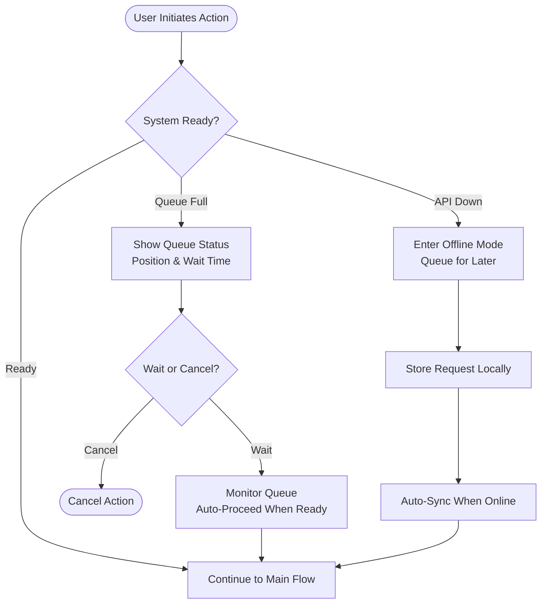
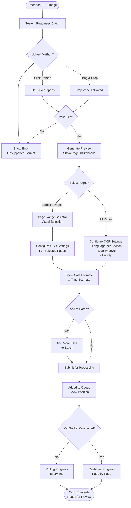

```mermaid
graph TD
    Start([OCR Text Ready]) --> Context[Analyze Document Context<br/>- Domain Detection<br/>- Language Pairs]

    Context --> GlossarySelect{Select Glossary}
    GlossarySelect -->|Auto| AutoSelect[Load Best Match<br/>Based on Context]
    GlossarySelect -->|Manual| ManualSelect[Choose from List<br/>or Create New]

    AutoSelect --> Version[Load Glossary<br/>Version Control]
    ManualSelect --> Version

    Version --> Detect[Pre-scan for<br/>Glossary Terms]

    Detect --> Highlight[Highlight & Lock<br/>Glossary Terms]

    Highlight --> Configure[Translation Settings<br/>- Target Language<br/>- AI Provider<br/>- Formality Level<br/>- Context Window Size]

    Configure --> Process[Begin Translation<br/>Preserve Locked Terms]

    Process --> NewTerms{New Terms<br/>Detected?}

    NewTerms -->|Yes| Suggest[AI Suggests<br/>Glossary Additions]
    NewTerms -->|No| Apply[Apply Existing<br/>Glossary]

    Suggest --> UserReview{User Reviews<br/>Suggestions}
    UserReview -->|Accept| UpdateGlossary[Update Glossary<br/>For Next Docs]
    UserReview -->|Modify| EditTerms[Edit Suggestions]
    UserReview -->|Reject| Apply

    EditTerms --> UpdateGlossary
    UpdateGlossary --> Apply

    Apply --> QualityCheck{Quality Score}

    QualityCheck -->|>90%| AutoApprove[Mark as 'Touched'<br/>Flag High Quality]
    QualityCheck -->|<90%| ManualReview[Open Side-by-Side<br/>Editor]

    AutoApprove --> Save[Save Translation<br/>Version Control]

    ManualReview --> Verify[User Verifies/<br/>Edits Translation]

    Verify --> Learn{Learn from Edits?}
    Learn -->|Yes| UpdatePatterns[Update Translation<br/>Patterns]
    Learn -->|No| Save2[Save Translation<br/>Mark as 'Verified']

    UpdatePatterns --> Save2

    Save --> Complete([Translation Complete])
    Save2 --> Complete
```

```mermaid
graph TD
    Start([Multiple Documents<br/>Selected]) --> Template{Use Template?}

    Template -->|Yes| LoadTemplate[Load Processing<br/>Template]
    Template -->|No| ConfigType{Config Type?}

    LoadTemplate --> ValidateTemplate{Template Valid<br/>For All Docs?}
    ValidateTemplate -->|Yes| ApplyTemplate[Apply Settings<br/>To All]
    ValidateTemplate -->|No| ShowConflicts[Show Conflicts<br/>Per Document]

    ShowConflicts --> ResolveConflicts[Resolve Each<br/>Conflict]
    ResolveConflicts --> ApplyTemplate

    ConfigType -->|Uniform| UniformSettings[Configure Once<br/>Apply to All]
    ConfigType -->|Individual| IndividualSettings[Configure Each<br/>Save as Template?]

    IndividualSettings --> SaveTemplate{Save Config<br/>as Template?}
    SaveTemplate -->|Yes| CreateTemplate[Create New Template<br/>Name & Share Settings]
    SaveTemplate -->|No| ApplyIndividual[Apply Individual<br/>Settings]

    CreateTemplate --> ApplyIndividual
    UniformSettings --> ApplyTemplate

    ApplyTemplate --> Priority[Set Batch Priority<br/>& Resource Allocation]
    ApplyIndividual --> Priority

    Priority --> ResourceCheck{Resources<br/>Available?}

    ResourceCheck -->|Limited| Optimize[Optimize Schedule<br/>- Off-peak Processing<br/>- Staggered Start]
    ResourceCheck -->|Available| Queue[Add to Processing<br/>Queue]

    Optimize --> Queue

    Queue --> Ownership[Assign Ownership<br/>& Permissions]

    Ownership --> View[Queue Dashboard<br/>- Position<br/>- Progress<br/>- Resource Usage]

    View --> Monitor{Monitor Type?}

    Monitor -->|Active| Live[Live Progress View<br/>WebSocket Updates]
    Monitor -->|Passive| Notify[Background Processing<br/>Configurable Notifications]

    Live --> Action{User Action?}

    Action -->|Pause| PauseFlow[Pause with State<br/>Save to Database]
    Action -->|Reorder| CheckPerm{Has Permission?}
    Action -->|Cancel| CancelFlow[Cancel & Save<br/>Partial Results]
    Action -->|Edit| EditQueue[Edit Settings<br/>For Queued Items]
    Action -->|Continue| Process[Continue Processing]

    CheckPerm -->|Yes| Reorder[Drag to Reorder<br/>Update Priority]
    CheckPerm -->|No| DenyReorder[Show Permission<br/>Error]

    Reorder --> Process
    DenyReorder --> Process
    EditQueue --> Process

    PauseFlow --> StateStore[(Store State<br/>in Database)]
    StateStore --> Resume[Resume Button<br/>Appears]
    Resume --> RestoreState[Restore from<br/>Database]
    RestoreState --> Process

    Process --> ItemComplete{Doc Complete?}

    ItemComplete -->|No| NextPage[Process Next Page<br/>Update Progress]
    ItemComplete -->|Yes| LearnFromDoc[Extract Patterns<br/>Update Template]

    NextPage --> ItemComplete
    LearnFromDoc --> NextDoc{More Docs?}

    NextDoc -->|Yes| AdaptiveLoad[Adaptive Resource<br/>Allocation]
    NextDoc -->|No| GenerateReport[Generate Batch<br/>Report]

    AdaptiveLoad --> Process

    GenerateReport --> SaveReport[Save Report<br/>Email Summary]
    SaveReport --> BatchComplete([Batch Complete])

    Notify --> BatchComplete
    CancelFlow --> PartialResults([Partial Results<br/>Available])
```

# User Flows & Interaction Patterns

## Pre-Flow: System Readiness Check

**User Goal:** Ensure system is ready before initiating any processing

**Entry Points:** Any action that requires processing resources

**Success Criteria:** User proceeds only when system can handle their request

**Flow Diagram:**


## Flow 1: Document Upload & OCR Processing (Enhanced)

**User Goal:** Upload a scanned religious manuscript and extract text via OCR with page-level control

**Entry Points:** Dashboard quick action, Documents > Upload Center, drag-drop from anywhere

**Success Criteria:** Document successfully processed with desired pages extracted accurately

**Flow Diagram:**


**Edge Cases & Error Handling:**
- File >100MB: Offer page range selection to reduce size
- Multi-script detection: Apply different language models per section
- Network interruption: Auto-resume with WebSocket reconnection
- Duplicate file: Show diff comparison with existing version
- OCR confidence low: Flag specific pages for manual review
- Mixed content PDF: Process digital and scanned pages separately

## Flow 2: Translation with Glossary Management (Enhanced with Learning Loop)

**User Goal:** Translate OCR'd text while maintaining terminology consistency and improving glossary

**Entry Points:** From OCR completion, Review > Verification Queue, Document Library action

**Success Criteria:** Translation preserves religious terminology with glossary learning

**Flow Diagram:**


**Edge Cases & Error Handling:**
- Glossary conflicts: Show term genealogy and usage stats
- Glossary versions: Allow rollback to previous versions
- API provider switch mid-flow: Maintain consistency
- Context overflow: Smart chunking with overlap
- Terminology drift: Alert when terms usage changes over time

## Flow 3: Batch Processing & Queue Management (Enhanced with Templates)

**User Goal:** Process multiple documents efficiently with templates and intelligent queue management

**Entry Points:** Documents > Upload Center, Processing > Batch Manager, Template Library

**Success Criteria:** All documents processed according to template with optimal resource usage

**Flow Diagram:**


**Edge Cases & Error Handling:**
- Template version mismatch: Offer migration or use latest
- Queue ownership transfer: Admin can reassign orphaned jobs
- Resource spike: Automatic throttling with user notification
- Partial failure: Intelligent retry with different settings
- Priority deadlock: Admin resolution interface
- Template permissions: Private, team, or organization-wide sharing

## Two-Panel Progressive Editor Workflow

### Stage 1: OCR Review
**Interface Layout:**
```
┌────────────────────────────────────────────────────────────────┐
│ [Stage 1: OCR Review] → [2: Translation Review] → [3: Complete] │
├────────────────────────────────────────────────────────────────┤
│  LEFT PANEL (50%)              │  RIGHT PANEL (50%)              │
│  ┌─────────────────────────┐   │  ┌─────────────────────────────┐│
│  │ SOURCE DOCUMENT         │   │  │ OCR OUTPUT EDITOR           ││
│  │                         │   │  │                             ││
│  │ [PDF Viewer]            │   │  │ Raw extracted text with:    ││
│  │ - Zoom controls         │   │  │ - Confidence highlighting   ││
│  │ - Pan tool              │   │  │ - Inline corrections        ││
│  │ - Page thumbnails       │   │  │ - Structure preservation    ││
│  │ - Highlight problems    │   │  │ - Search & replace          ││
│  │                         │   │  │ - Line merge/split tools    ││
│  └─────────────────────────┘   │  └─────────────────────────────┘│
│                                 │                                 │
│ [Save Draft] [Approve OCR & Proceed to Translation] →             │
└────────────────────────────────────────────────────────────────┘
```

### Stage 2: Translation Review
**Interface Layout:**
```
┌────────────────────────────────────────────────────────────────┐
│ [1: OCR Review] → [Stage 2: Translation Review] → [3: Complete] │
├────────────────────────────────────────────────────────────────┤
│  LEFT PANEL (50%)              │  RIGHT PANEL (50%)              │
│  ┌─────────────────────────┐   │  ┌─────────────────────────────┐│
│  │ VIEW TOGGLE:            │   │  │ TRANSLATION EDITOR          ││
│  │ ○ Original PDF          │   │  │                             ││
│  │ ● OCR Text              │   │  │ Translated text with:       ││
│  │ ○ Split View            │   │  │ - Glossary highlighting     ││
│  │                         │   │  │ - Confidence indicators     ││
│  │ [Approved OCR Text]     │   │  │ - Alternative suggestions   ││
│  │ with structure markers  │   │  │ - Target lang selector      ││
│  │ Line breaks preserved   │   │  │ - Quick corrections         ││
│  │ Indentation maintained  │   │  │ - Version history           ││
│  └─────────────────────────┘   │  └─────────────────────────────┘│
│                                 │                                 │
│ [Back to OCR] [Request Review] [Approve Translation & Complete] → │
└────────────────────────────────────────────────────────────────┘
```

## Key Interaction Patterns

### Progressive Disclosure
- **Level 1:** Simple drag-and-drop upload
- **Level 2:** Page selection and basic settings
- **Level 3:** Advanced OCR configuration
- **Level 4:** Batch processing and templates

### Real-time Feedback
- **WebSocket Updates:** Live progress on processing
- **Optimistic UI:** Immediate response to user actions
- **Progress Indicators:** Visual feedback for long operations
- **Status Badges:** Clear document state communication

### Contextual Intelligence
- **Smart Suggestions:** Based on document content and history
- **Glossary Matching:** Automatic term identification
- **Template Recommendations:** Based on document patterns
- **Error Prevention:** Validation before processing

### Approval Gates
- **OCR → Translation:** User must approve OCR before translation
- **Translation → Export:** Quality check before final output
- **Batch Operations:** Confirm settings before processing
- **Glossary Updates:** Review suggestions before saving

## Mobile & Responsive Considerations

### Mobile Flow Adaptations
- **Single Panel View:** Switch between source and output
- **Bottom Sheet Actions:** Quick actions and settings
- **Swipe Navigation:** Between processing stages
- **Touch Optimization:** Larger tap targets and gestures

### Tablet Optimizations
- **Side-by-side Panels:** Maintain desktop-like experience
- **Collapsible Sidebars:** More space for content
- **Touch-friendly Controls:** Drag-and-drop, pinch-zoom
- **Floating Action Buttons:** Quick access to common actions

These user flows ensure a smooth, intuitive experience that guides users through complex OCR and translation workflows while maintaining the quality and cultural sensitivity required for religious and specialized content.